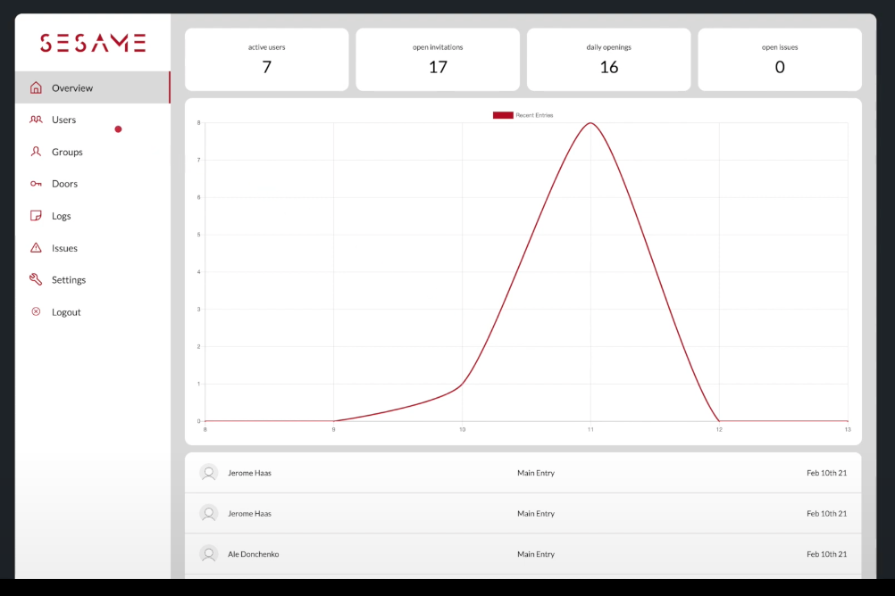

# Admin Dashboard 

## Description
The admin dashboard provides an easy overview of your access management. The person who is charge for the access management can customize who can enter which doors to which times.



## Getting started
```bash
git clone https://github.com/AlexandraDonchenko/admin-dashboard.git
cd admin-dashboard
npm start
```

Now, start the backend server and the Docker image - you can find a description on how to do in the repo 'backend'.

Open http://localhost:3000 with your browser to see the result.

Go to 'login' and log in with your credentials.

## Features
- get an overview for:
  - active users
  - open invitations
  - daily openings
  - open issues
- add, update and deactivate users
- add groups and assign them to users 
- add doors which can be added to groups
- overview of all logs and see:
  - who entered
  - on which time
  - which door
- overview for reported issues
- in the settings page you can:
   - switch theme to dark/light
   - change email address
   - change password

## Contributing
We'd love to have your helping hand on sesame! For more information on what we're looking for and how to get started, just contact us via info@sesame-ai.tech.
