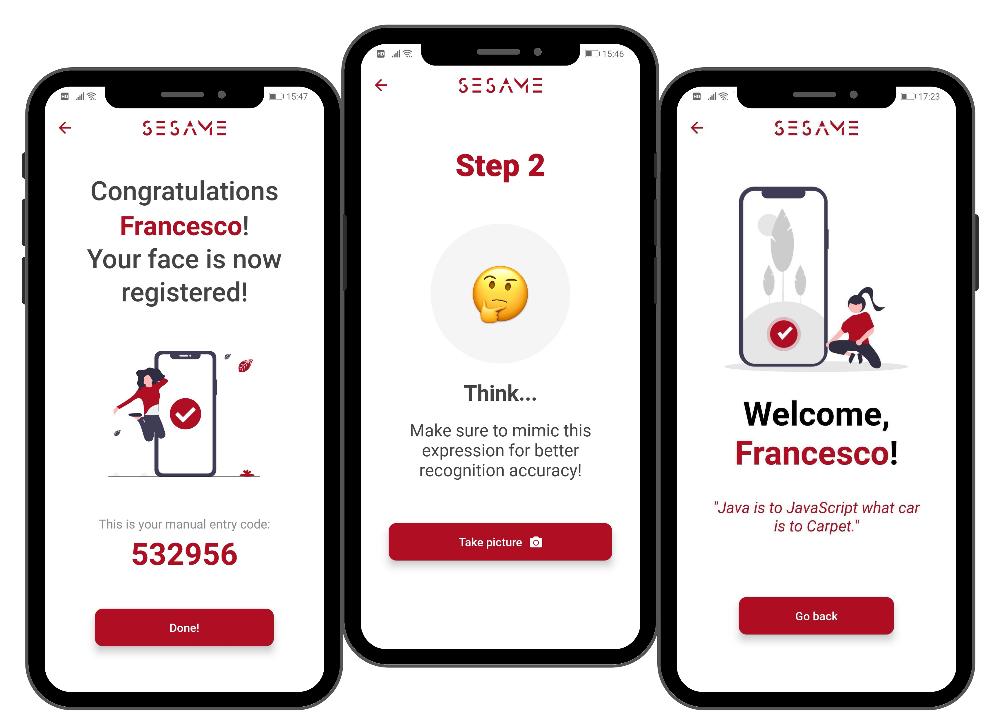

# Native App files for Sesame

 

 

 

Sesame is an enterprise access management tool harnessing the power of machine learning and computer vision. It consists of two parts:

- An admin dashboard where the companies can manage their employees profiles and access rights.
- A native app that employees can use to access different areas of their offices.

## Native App

 

 

In the native app you can register and enter your company's premises:

1. Get a registration code and a QR code from your employer.
2. Enter that registration code or scan the QR to start your registration process.
3. Take 3 pictures of your face and have your profile saved in the company database.
4. Select a door and scan your face to open it! Make sure you're allowed to enter...the app knows!
5. Alternatively, you can manually enter your personal access key.

### Tech stack

- React Native
- Expo
- Redux (thunk)
- Lottie
